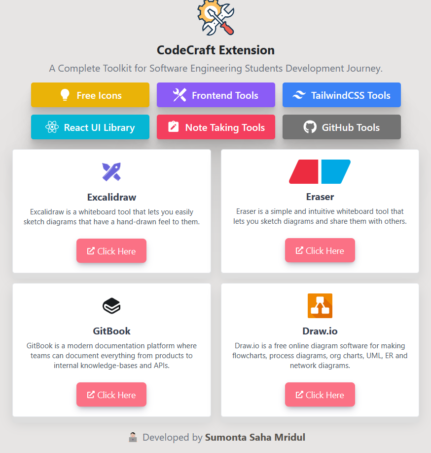
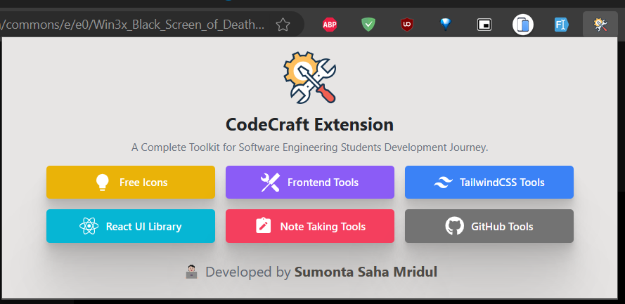

  <h1>CodeCraft Extension</h1>

CodeCraft Extension is an open-source project that provides A Complete Toolkit for Software Engineering Students. This project is open to contributions.

## 📝 Getting Started

These instructions will get you a copy of the project up and running on your local machine for development and testing purposes.

### ✍🏻 My Extension: A Complete Setup Guide

#### 📥 Downloading the Extension

1. Visit the official Release Version in GitHub repository of the extension. **( [✅ Download Link](https://github.com/Sumonta056/CodeCraft-Extension/releases/download/CodeCraft/CodeCraft.Extension.zip) )**
2. Look for the latest release of the extension. It should be a `.zip` file.
3. Click on the download link to start the download process. Save the file to a location on your computer that you can easily access.

#### 📦 Unpacking the Extension

1. Navigate to the location where you saved the downloaded .zip file.
2. Right-click on the .zip file and select Extract All... from the context menu.
3. Choose a destination folder for the extracted files and click Extract.

#### 🖥️ Installing the Extension in Your Browser

1. Open the Extension Management page by navigating to `chrome://extensions` (for Chrome) or `edge://extensions` (for Edge). The Extension Management page can also be opened by clicking on the Chrome menu, hovering over More Tools then selecting Extensions.

2. Enable `Developer Mode` by clicking the toggle switch next to Developer mode.

3. Click the `Load unpacked` button and navigate to the location of the extracted extension files. Select the extension directory and click OK.

#### 🚀 Using the Extension

1. After successfully installing the extension, you should see its icon in your browser's toolbar. Click on this icon to open the extension.

2. The extension's user interface will appear. Here, you can access all the features of the extension.

For more detailed instructions on how to use specific features of the extension, refer to the extension's user guide or help documentation.

#### 🔄 Updating the Extension

To update the extension to a newer version, simply repeat the steps in the Downloading the Extension and Unpacking the Extension sections with the new .zip file. Then, in the Extension Management page, click on the Reload button under the extension's details.

#### ❓ Getting Help

If you encounter any issues while using the extension, please refer to the extension's FAQ or support documentation. You can also contact the extension's support team for further assistance.

We hope you enjoy using our extension!

### 🛂 Contributing to CodeCraft Extension

Read The Guidelines : <a href="https://github.com/Sumonta056/GitHub-Follower-Notification-Action-Bot/blob/main/Contribution.md">Here</a>

### 🔖 License

This project is licensed under the terms of the MIT license.

<strong>&copy; 2024 All Rights Reserved by Sumonta Saha Mridul</strong>

