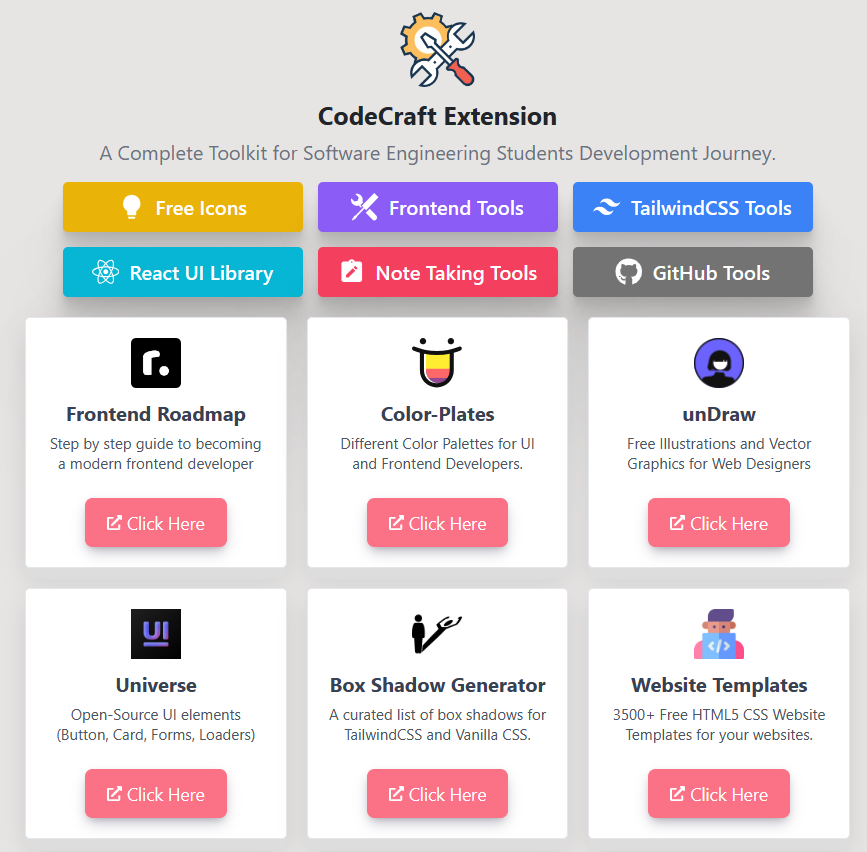
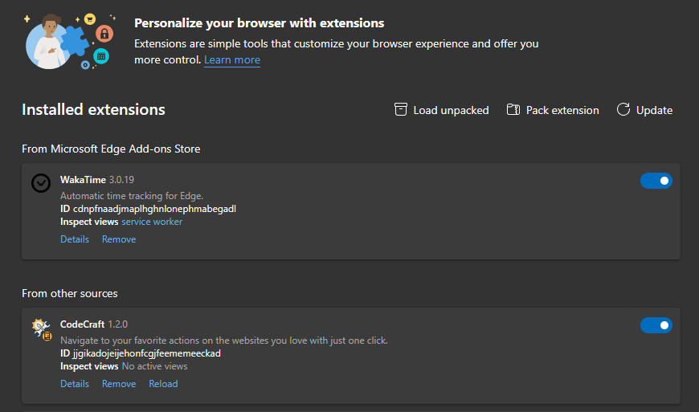

<div align ="center">
  <h1>CodeCraft Extension</h1>


CodeCraft Extension is an open-source project that provides A Complete Toolkit for Software Engineering Students. This project is open to contributions.



</div>

## 📝 Getting Started

These instructions will get you a copy of the project up and running on your local machine for development and testing purposes.

## ❓ Prerequisites

- Node.js
- npm

## ⚙️ Installation

1. Clone the repo
   ```bash
   git clone https://github.com/Sumonta056/CodeCraft-Extension.git
   ```
2. Go to the folder where you cloned the repo
   ```bash
   cd CodeCraft-Extension
   ```
3. Install NPM packages
   ```bash
   npm i --legacy-peer-deps
   ```
4. Run the development server
   ```bash
     npm run dev
   ```
5. Build the extension
   ```bash
     npm run build
   ```

## ✍🏻 Setup Extension in Your Browser : Google Chrome / Microsoft Edge

1. Open the Extension Management page by navigating to `chrome://extensions` (for Chrome) or `edge://extensions` (for Edge). The Extension Management page can also be opened by clicking on the Chrome menu, hovering over **More Tools** then selecting **Extensions**.

2. Enable Developer Mode by clicking the toggle switch next to **Developer mode**.

3. Click the **Load unpacked** button and select the extension directory.



<hr>

### 🛂 Contributing to CodeCraft Extension

Read The Guidelines : <a href="https://github.com/Sumonta056/GitHub-Follower-Notification-Action-Bot/blob/main/Contribution.md">Here</a>

### 🔖 License

This project is licensed under the terms of the MIT license.

<hr>

<div align="center">
<strong>&copy; 2024 All Rights Reserved by Sumonta Saha Mridul</strong>
</div>
